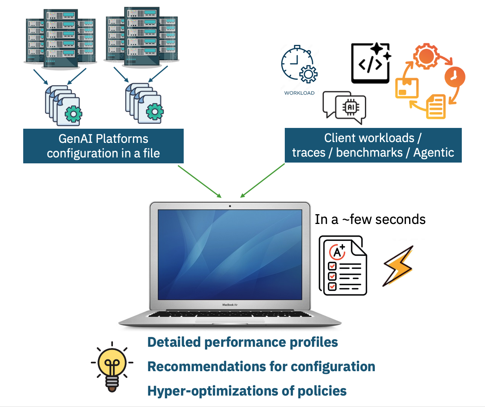

# Opal - A Discrete-event based LLM Inference Platform Simulator in Python
- [Opal - A Discrete-event based LLM Inference Platform Simulator in Python](#opal---a-discrete-event-based-llm-inference-platform-simulator-in-python)
  - [Overview](#overview)
  - [Dependencies](#dependencies)
    - [Option 1: Using conda (traditional approach)](#option-1-using-conda-traditional-approach)
    - [Option 2: Using uv (faster alternative)](#option-2-using-uv-faster-alternative)
  - [Usage](#usage)
  - [What are simulation outputs](#what-are-simulation-outputs)
  - [Logging](#logging)
  - [Configuration](#configuration)
  - [Development](#development)
    - [Unit Tests](#unit-tests)
  - [Working with `pypy`](#working-with-pypy)
    - [Installing `pypy`](#installing-pypy)
    - [Running opal with `pypy`](#running-opal-with-pypy)
    - [Contributions](#contributions)

<p align="center">
<figure>

<figcaption>High-level Opal simulator concept.</figcaption>
</figure>
</p>

## Overview 
Opal (O.P.A.L. - Open simulator Platform for distributed AI and LLM workflows) is an LLM platform-level simulator written purely in Python. It can be used to explore policies, deployment configurations, optimizations, and what-if scenarios for scalable, distributed inference services like llm-d or Dynamo. It captures the first-level conceptual details of various components involved in servicing an inference request in a distributed setting - workload, router, autoscaler, vLLM worker, distributed KV-cache management, distributed storage, and infrastructure (GPU, DRAM, NVMe storage, network). Furthermore, the simulator can quickly and cheaply explore different configurations and trade-offs in the design of a distributed inference service, quantifying performance (TTFT, ITL, TPOT, GPU utilization etc.), cost ($/token), and energy requirements.


Why (yet another) simulator: 
  * **Cost:** Access to high-end GPU _and_ storage infrastructure is expensive. We need a way to continue research and exploration without being limited by the available hardware. 
  * **Complexity:** The design and configuration space of policies involving LLM workers, routers, storage backends, and workload generation is vast and complex. We need a way to conceptually explore the relationships between them in a fast and pragmatic manner. 
  * **Speed:** Modern LLM infrastructure is complex and has 100k+ lines of code that get executed to service a request. Engineering effort to develop a feature can be significant, and we need to make sure that the features we bet on actually deliver the expected gains. The simulator helps us quickly explore high-impact, promising directions to prioritize development. 

This guide is just to get you started. We will add more details to the wiki as the project development progresses: 

  * **Wiki:** [https://github.com/IBM/opal-sim/wiki](https://github.com/IBM/opal-sim/wiki)

## Dependencies
We recommend using a Python virtual environment to get started. You can use either **conda** or **uv** (a fast Python package installer and resolver). If you already have these dependencies installed in the global environment, that is also fine.

### Option 1: Using conda (traditional approach)

```shell
conda create --name opal-dev python=3.11 --yes
conda activate opal-dev
```

git clone and install the requirements

```shell
git clone git@github.ibm.com:zrl-cloud-data-platforms/opal-sim.git
cd opal-sim
python -m pip install -r ./requirements.txt
```

### Option 2: Using uv (faster alternative)

First, install uv if you haven't already:
```shell
# On macOS and Linux
curl -LsSf https://astral.sh/uv/install.sh | sh

# Or using pip
pip install uv
```

Then clone and set up the project:

```shell
git clone git@github.ibm.com:zrl-cloud-data-platforms/opal-sim.git
cd opal-sim

# Create a virtual environment with Python 3.11
uv venv --python 3.11

# Activate the virtual environment
source .venv/bin/activate  # On Windows: .venv\Scripts\activate

# Install the project with all dependencies
uv pip install -e .
```

**Note:** uv is significantly faster than pip for dependency resolution and installation.

## Usage 
Here is the simplest run that should work out of the box 
```shell
# from the top-level directory, add the python package path 
PYTHONPATH=`pwd`:$PYTHONPATH python ./opal/main.py
```

It should produce output like the following (showing the last few lines), similar to what you see in `vllm serve` benchmarks...
```shell
===== stage_0 =====
============ Serving Benchmark Result ============
Note: negative values means that no sensible values can be calculated.
--------------------------------------------------
Successful requests                     :          100.00
Failed requests                         :            0.00
Benchmark duration (s)                  :           54.27
Total input tokens                      :      785,877.00
Total generated tokens                  :        8,178.00
Request throughput (req/s)              :            1.84
Output token throughput (tok/s)         :          150.69
Peak output token throughput (tok/s)    :           -1.00
Peak concurrent requests                :           -1.00
Total Token throughput (tok/s)          :       14,631.55
 ---------------Time to First Token----------------
Mean TTFT (ms)                          :        2,096.07
Median TTFT (ms)                        :        2,179.57
P99 TTFT (ms)                           :        4,719.88
 -----Time per Output Token (excl. 1st token)------
Mean TPOT (ms)                          :           23.53
Median TPOT (ms)                        :           20.39
P99 TPOT (ms)                           :           62.32
---------------Inter-token Latency----------------
Mean ITL (ms)                           :           22.95
Median ITL (ms)                         :           11.61
P99 ITL (ms)                            :          346.45
*--------------------------------------------------
Not plotting graphs as --no-graphs was set.
If you want the final graphs, please specify -g / --graphs flag.
===== stage_1 =====
============ Serving Benchmark Result ============
Note: negative values means that no sensible values can be calculated.
--------------------------------------------------
Successful requests                     :          100.00
Failed requests                         :            0.00
Benchmark duration (s)                  :          156.73
Total input tokens                      :    1,524,742.00
Total generated tokens                  :       36,758.00
Request throughput (req/s)              :            0.64
Output token throughput (tok/s)         :          234.53
Peak output token throughput (tok/s)    :           -1.00
Peak concurrent requests                :           -1.00
Total Token throughput (tok/s)          :        9,963.00
 ---------------Time to First Token----------------
Mean TTFT (ms)                          :       68,336.36
Median TTFT (ms)                        :       68,710.32
P99 TTFT (ms)                           :      143,565.98
 -----Time per Output Token (excl. 1st token)------
Mean TPOT (ms)                          :           53.95
Median TPOT (ms)                        :           41.98
P99 TPOT (ms)                           :          131.40
---------------Inter-token Latency----------------
Mean ITL (ms)                           :           56.87
Median ITL (ms)                         :           16.68
P99 ITL (ms)                            :          752.26
*--------------------------------------------------
Not plotting graphs as --no-graphs was set.
If you want the final graphs, please specify -g / --graphs flag.
Opal: Good bye!
-------------
Python Garbage collector stats:
[{'collections': 381, 'collected': 16467, 'uncollectable': 0}, {'collections': 34, 'collected': 1710, 'uncollectable': 0}, {'collections': 3, 'collected': 460, 'uncollectable': 0}]
=========
```

When this command is executed, it takes the default config file `./opal/sim_config/defaults.json` and runs the simulation. The `-g` flag tells it to produce the final graphs as well. You can pass a config file with the `-c` parameter like 
```shell 
python ./opal/opal.py -c ./opal/sim_config/your_config.json -g
```

In the `./simulation-runs/` folder you should see a new folder named with the current date and time containing the full simulation output. You should see directories like `stage_0`, `stage_1`, and `stage_2`. Within these folders are graphs and JSON files. 

## What are simulation outputs 

Each run of the simulation is saved in the `simulation-run` folder (default). This location can be changed with the `-o` flag when starting the simulator. Within this folder, directories are named with the format `sim-$year-$month-$day-$hour-$min-$sec` in which all data is saved. Upon a successful run you should see the following files in each stage folder: 
  * `cdf-latencies.pdf`: plots the CDFs for all requests for three series — end-to-end latencies, queuing latencies, and pure GPU/TTFT times. 
  * `gpu-utilization-per-sec.pdf`: plots global average GPU utilization per second. 
  * `histo-latencies.pdf`: plots the E2E latencies histogram. 
  * `thrp-request-sec.pdf`: plots per-second inference requests completed in the system. 
  * `thrp-workers-sec.pdf`: plots active workers per second. When worker scaling is disabled, you will just see a flat line. 
  * `opal_stats.json`: all collected statistics for the simulation. Parts of them are plotted by default. 

In the top-level folder, you should have: 
  * `sim_config.json`: the simulation config that was used for this run. 
  * `simulation.log`: the simulation log file containing all the output. See the [Logging](#logging) section.

## Logging 
There is an environment variable `OPAL_LOG_LEVEL` that you can set to change the logging level between `INFO` (default), `DEBUG`, `WARN`, or `ERROR`. 

The full output is saved in the simulation directory as `simulation.log` file. 

There are also two additional flags (see `opal_logging.py` for details): 
 * `OPAL_LOG_FORMAT`: valid values are 0, 1, 2 with increasing verbosity. Default is 0. 
 * `OPAL_NO_COLOR`: if set, no color will be used in the output. Better for log parsing. 
 
**How to enable:** 
```shell 
OPAL_LOG_LEVEL=DEBUG PYTHONPATH=`pwd`:$PYTHONPATH ./opal/main.py
```

## Configuration 
We have a single JSON file with all the parameters for the simulation. For documentation of this configuration file, please see: https://github.ibm.com/kvc-storage/opal-sim/wiki/Configuration-Simulation

## Development 

### Unit Tests 
Running all tests (~20-30 seconds) 
```shell 
opal-sim$ pytest 
```
to see the output and details run with `-s` and `-v` flags. 

To run a specific test: 
```shell
opal-sim$ OPAL_LOG_LEVEL=DEBUG pytest -s -v ./tests/test_runtimes.py
```


## Working with `pypy` 

`pypy` is a fast JIT compiler which supports Python version `3.11` as of this writing. If you want to try out the performance of `pypy`, you can install it and run the simulation with it.  

### Installing `pypy` 
```shell 
brew install uv
# Make PyPy 3.11 available on this machine
uv python install pypy@3.11
# Creates a virtual environment using the PyPy interpreter you just installed
uv venv --python pypy@3.11
```

Unfortunately, simply installing the default `transformers` package does not work with `pypy`, so the recommended way is to install the `transformers` package with `uv` separately without dependencies (we need this for config parsing): 

```shell 
uv pip install --no-deps transformers
```

Remove it as a dependency from `pyproject.toml` file, like: 
```patch 
diff --git a/pyproject.toml b/pyproject.toml
index 2e96d77..b8e3b4a 100644
--- a/pyproject.toml
+++ b/pyproject.toml
@@ -19,7 +19,6 @@ dependencies = [
     "tqdm",
     "pytest>=9.0",
     "black>=25.0",
-    "transformers>=4.55.4",
 ]

 [project.optional-dependencies]
```

Then do the rest of the system install 
```shell 
uv pip install -e . 
```

### Running opal with `pypy` 
We cannot specify Hugging Face models now as the `transformers` library is not fully functional under `pypy`. Instead, we must provide the complete, locally-downloaded model config file in the Opal simulation configuration file like: 
```json 
  "model": {
    "model_params": {
      "name": "Llama-3.3-70B-Instruct",
      "config_dir": "./opal/model_config/"
    }
  },
```

With this, it should now work with `pypy` as follows: 
```shell 
pypy3 ./opal/main.py
```

**NOTE:** Performance gains from `pypy` will only materialize for long-running simulations, as JIT compilation needs time to warm up. We see almost 2x speedup in the case where Moonshot traces are replayed with a single worker. 

With python:
```shell 
$ python ./opal/main.py -c ~/zrl/github/opal-sim/opal/sim_config/moonshot-1.json
...

INFO(environment.py:149): Simulation completed in 142.53 seconds (wall clock time) for 10268.00 virtual seconds | speed up 72.04x
===== stage_0 =====
============ Serving Benchmark Result ============
Note: negative values means that no sensible values can be calculated.
--------------------------------------------------
Successful requests                     :       12,031.00
Failed requests                         :            0.00
Benchmark duration (s)                  :       10,268.00
Total input tokens                      :  144,793,823.00
Total generated tokens                  :    4,122,048.00
Request throughput (req/s)              :            1.17
Output token throughput (tok/s)         :          401.45
Peak output token throughput (tok/s)    :           -1.00
Peak concurrent requests                :           -1.00
Total Token throughput (tok/s)          :       14,502.91
 ---------------Time to First Token----------------
Mean TTFT (ms)                          :    3,699,620.04
Median TTFT (ms)                        :    3,793,004.96
P99 TTFT (ms)                           :    6,655,139.21
 -----Time per Output Token (excl. 1st token)------
Mean TPOT (ms)                          :          104.50
Median TPOT (ms)                        :          102.77
P99 TPOT (ms)                           :          244.22
---------------Inter-token Latency----------------
Mean ITL (ms)                           :          108.07
Median ITL (ms)                         :           25.99
P99 ITL (ms)                            :        2,081.82
*--------------------------------------------------
```

With `pypy`: 
```shell 
$ pypy3 ./opal/main.py -c ~/zrl/github/opal-sim/opal/sim_config/moonshot-1.json
... 
INFO(environment.py:149): Simulation completed in 58.15 seconds (wall clock time) for 10268.00 virtual seconds | speed up 176.58x
===== stage_0 =====
============ Serving Benchmark Result ============
Note: negative values means that no sensible values can be calculated.
--------------------------------------------------
Successful requests                     :       12,031.00
Failed requests                         :            0.00
Benchmark duration (s)                  :       10,268.00
Total input tokens                      :  144,793,823.00
Total generated tokens                  :    4,122,048.00
Request throughput (req/s)              :            1.17
Output token throughput (tok/s)         :          401.45
Peak output token throughput (tok/s)    :           -1.00
Peak concurrent requests                :           -1.00
Total Token throughput (tok/s)          :       14,502.91
 ---------------Time to First Token----------------
Mean TTFT (ms)                          :    3,699,620.04
Median TTFT (ms)                        :    3,793,004.96
P99 TTFT (ms)                           :    6,655,139.21
 -----Time per Output Token (excl. 1st token)------
Mean TPOT (ms)                          :          104.50
Median TPOT (ms)                        :          102.77
P99 TPOT (ms)                           :          244.22
---------------Inter-token Latency----------------
Mean ITL (ms)                           :          108.07
Median ITL (ms)                         :           25.99
P99 ITL (ms)                            :        2,081.82
*--------------------------------------------------
```
### Contributions 
Open a pull request. 

Convention to follow: Black Python formatter. Install and run the formatter before sending the pull request 

```shell 
python -m pip install black
# once you are ready with the code, run from the top-level directory 
sh-black-formatter.sh 
```
